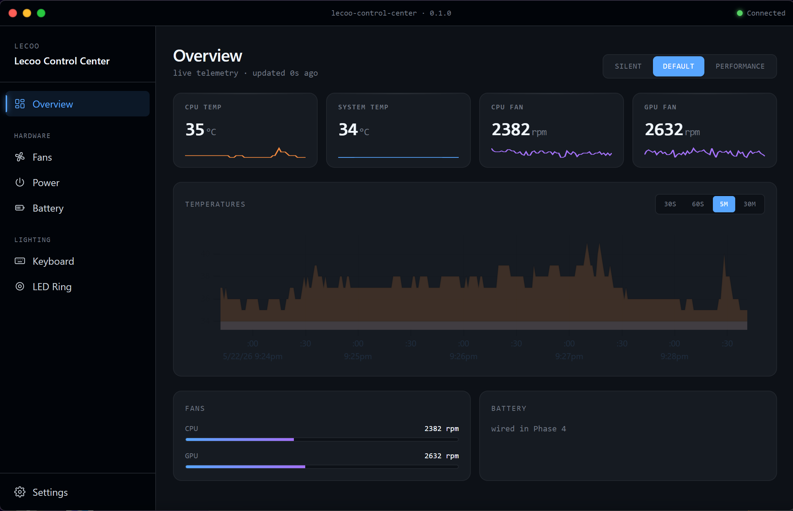
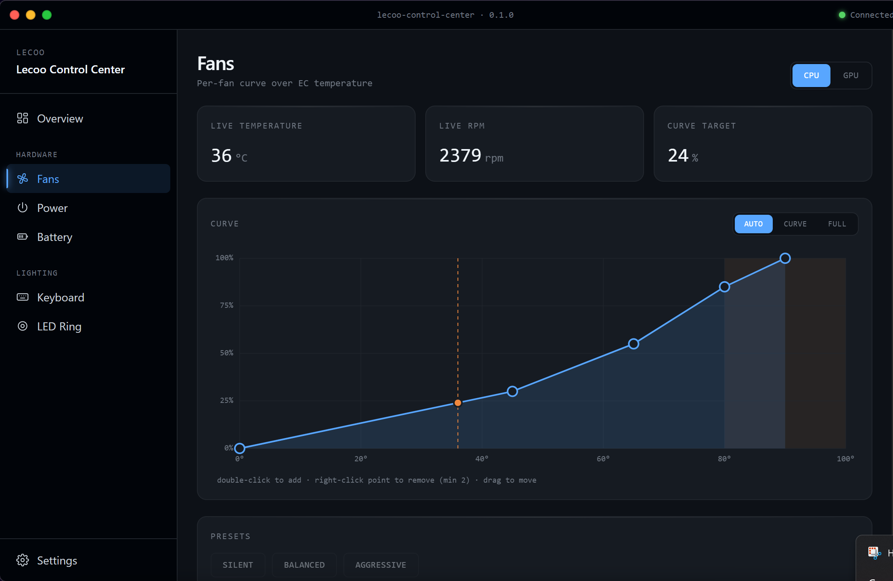
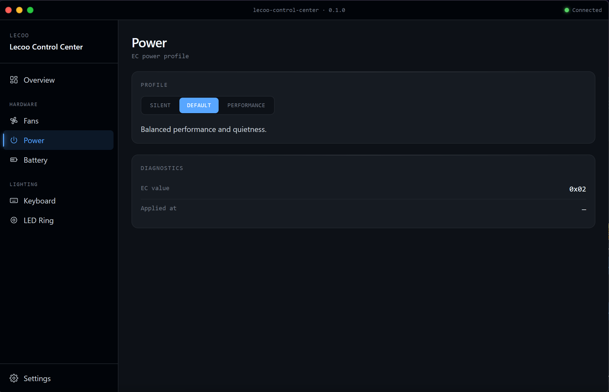
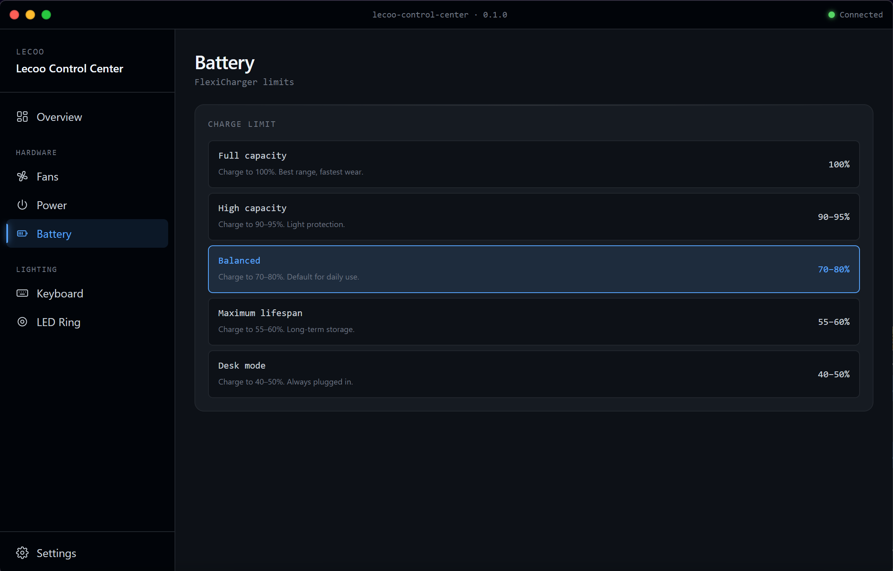
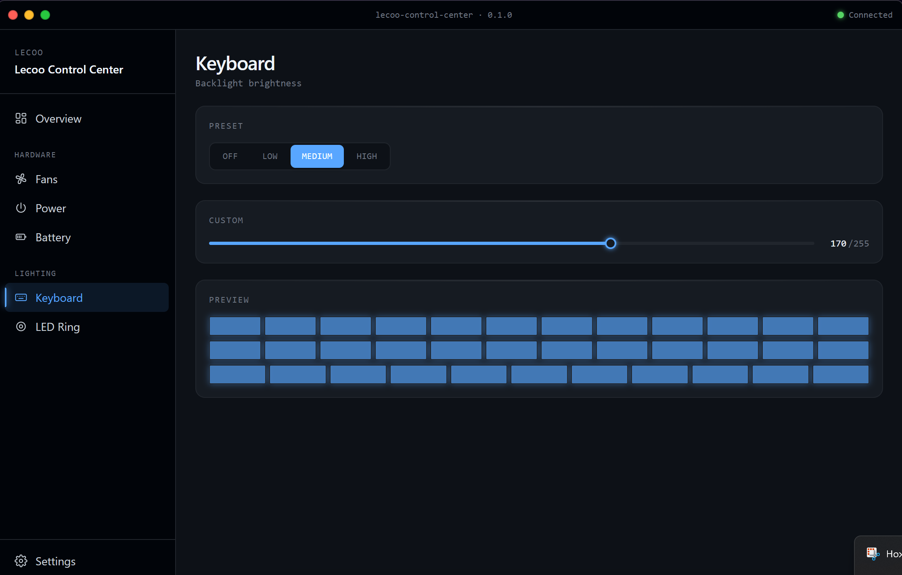
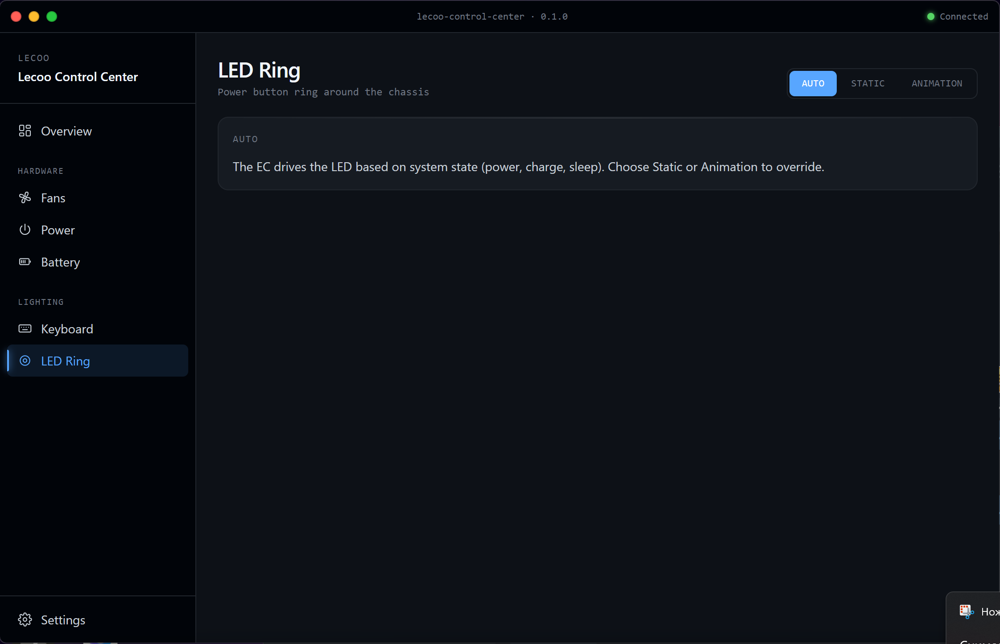
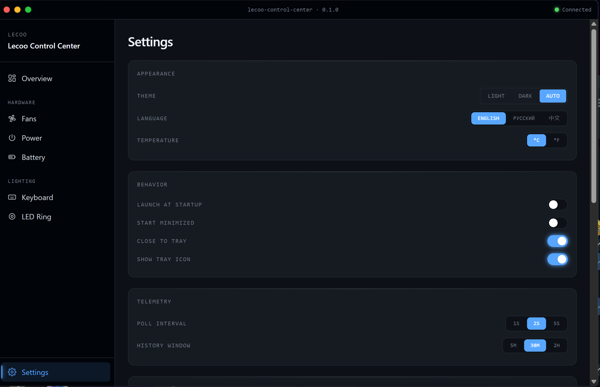

<div align="center">


<h1>Lecoo Control Center</h1>

<p>
A desktop control center for Lecoo / Emdoor laptops — live telemetry, per-fan curves, power profiles, battery limits, keyboard backlight and rear LED ring control, all driven by a Windows service that talks to the laptop's Embedded Controller.
</p>

[](LICENSE)
[](https://github.com/A-mi13/Lecoo-Control-Center)
[](https://tauri.app/)
[](https://github.com/A-mi13/Lecoo-Control-Center)
[](https://github.com/A-mi13/Lecoo-Control-Center)

</div>

**Languages:** [English](README.md) · [中文](README_CN.md) · [Русский](README_RU.md)

## About this fork

This repository is a fork of [LaVashikk/Lecoo-Control-Center](https://github.com/LaVashikk/Lecoo-Control-Center) — the original project that reverse-engineered the ITE IT5570 / IT8987 Embedded Controllers used in the Lecoo Pro 14 (N155) family of laptops and built a Rust daemon plus a `lecoo-ctrl` CLI on top of them. **All credit for the underlying EC research, the IPC protocol, the daemon, and the CLI belongs to LaVashikk.**

This fork adds and changes the following:

- **Tauri 2 + React desktop GUI** — a full control surface for monitoring and configuration: live temperature/RPM tiles, a uPlot temperature chart with selectable time ranges, an SVG fan-curve editor with drag-to-edit points and presets, power-profile and FlexiCharger limits, keyboard backlight with a live key preview, an LED-ring animation builder, custom titlebar with live connection status, system tray with quick profile/fan submenus, autostart, light/dark/auto themes, and English/Russian/Chinese localisation. *(this is the main reason this fork exists.)*
- **MSI installer that registers the daemon as a Windows Service** — one `Lecoo Control Center_*.msi` installs the GUI, the daemon, and `inpoutx64.dll`, then registers `LecooControlDaemon` as a LocalSystem auto-start service. After install the GUI opens like any normal program — no UAC prompts, no manual `cargo run --release` from an Administrator shell.
- **In-app diagnostics for bug reports** — Settings → Diagnostics → Copy diagnostics packages the GUI version, OS info, last daemon error, and a tail of the rotating log into a markdown block that can be pasted straight into a GitHub issue. Verbose logging can be toggled from the same screen.
- **Daemon improvements (planned in this fork)** — server-side fan curve evaluation, resume-from-sleep state restore, Windows 11 25H2 service-start fix, and an EC I/O lock-contention guard. These land alongside the GUI work and are tracked in [CHANGELOG.md](CHANGELOG.md).

Everything else — EC HRAM probing, PWM control, FlexiCharger thresholds, LED ring animations, the IPC protocol on the wire — comes straight from upstream.

## Status

The GUI is in **beta**. All seven feature phases (shell, telemetry, dashboard, power/battery/keyboard, fan curves, LED ring, settings + tray) are implemented and build into a working MSI on Windows. The remaining work before a tagged v1.0 release is the daemon-side improvements listed above and a signed release pipeline.

## Screenshots

<table>
  <tr>
    <td align="center"><br><sub>Overview · live telemetry</sub></td>
    <td align="center"><br><sub>Fans · curve editor</sub></td>
  </tr>
  <tr>
    <td align="center"><br><sub>Power · profile + diagnostics</sub></td>
    <td align="center"><br><sub>Battery · FlexiCharger</sub></td>
  </tr>
  <tr>
    <td align="center"><br><sub>Keyboard · backlight</sub></td>
    <td align="center"><br><sub>LED Ring · animation builder</sub></td>
  </tr>
  <tr>
    <td colspan="2" align="center"><br><sub>Settings · themes, language, diagnostics</sub></td>
  </tr>
</table>

## Features

- ✨ **Live telemetry** — CPU and system temperatures, CPU and GPU fan RPM, refreshed once a second over the daemon's IPC channel. Bounded history (up to 30 minutes) feeds a temperature chart with 30 s / 60 s / 5 m / 30 m range pills and four stat tiles with inline sparklines.
- 🌡️ **Fan curves** — interactive SVG editor for the CPU and GPU fans. Drag points to move them, double-click to add, right-click to remove. The live temperature rides the curve so you can see what duty cycle a given thermal point will produce. Three starting presets (Silent / Balanced / Aggressive). Curves are evaluated continuously by a 500 ms client-side runner today; server-side evaluation is part of the planned daemon work.
- ⚡ **Power profiles** — one-click Silent / Default / Performance switching from the dashboard, the Power page, and the system tray. The active profile rides the tray icon's submenu.
- 🔋 **Battery limits (FlexiCharger)** — Full / High / Balanced / Maximum Lifespan / Desk Mode, with each option labelled by its real percentage range and a one-line rationale.
- ⌨️ **Keyboard backlight** — Off / Low / Medium / High presets and a 0–255 custom slider. A 3-row mini-keyboard preview lights up in real time so you can see the level before committing.
- 💡 **Rear LED ring** — Auto (let the EC drive it), Static (slider 0–255 with a glowing preview ring), or Animation: a full breathing-config builder (max brightness, step up/down, hold at max/min) with eleven named presets (smooth, sleep, alert, zen, ping, energetic, warning, vacuum, panic, sonar, toxic) — each preset has its own thumbnail breath-curve.
- 🎨 **Themes** — light, dark, and auto (follows `prefers-color-scheme`). Theme tokens live in CSS variables so the chart, sparklines, and LED ring all stay theme-consistent.
- 🌍 **Internationalisation** — English, Русский, 中文 out of the box. Language and theme are picked from Settings and persisted.
- 📌 **System tray** — left-click opens the window, the menu has quick Power-profile and Fan-mode submenus, and closing the window minimizes to tray (Quit in the tray menu is the real way out).
- 🔧 **In-app diagnostics** — log folder shortcut, one-button "Copy diagnostics" bundle, runtime verbose-logging toggle. See *Reporting bugs* below.

For the lower-level CLI (`lecoo-ctrl ...`) commands — temperature reads, manual PWM, telemetry opt-out — see the [upstream README](https://github.com/LaVashikk/Lecoo-Control-Center). The CLI is preserved unchanged in this fork.

## Installation

The recommended way to install is via the MSI:

1. Grab the latest `Lecoo Control Center_*.msi` from the [Releases page](https://github.com/A-mi13/Lecoo-Control-Center/releases) once a tagged build is published, **or** build one yourself from source (see below).
2. Run it as Administrator. The installer copies the GUI and daemon into `C:\Program Files\Lecoo Control Center\` and registers the daemon as a Windows service called `LecooControlDaemon` (LocalSystem, auto-start).
3. After install, open **Lecoo Control Center** from the Start menu. The GUI launches as a regular user — the service is already running in the background and handling EC access.

To verify the service after install:

```powershell
sc query LecooControlDaemon
# expect: STATE : 4 RUNNING
```

To remove cleanly: uninstall via Windows Settings → Apps. The installer stops and unregisters the service for you.

## Building from source

You will need:

- Rust stable toolchain (1.80+) — install via [rustup](https://rustup.rs/).
- Node.js 20+ and pnpm 9+ for the GUI front-end.
- Tauri 2 prerequisites for your platform — see the [Tauri prerequisites guide](https://v2.tauri.app/start/prerequisites/). On Windows that is the MSVC build tools and WebView2 (already bundled with Windows 11).

Clone the repo and build:

```bash
git clone https://github.com/A-mi13/Lecoo-Control-Center.git
cd Lecoo-Control-Center

# Daemon + CLI (release build)
cargo build --release -p lecoo-ec-daemon
cargo build --release -p cli

# GUI installer (MSI)
cd gui
pnpm install
pnpm tauri build
```

`pnpm tauri build` produces a single MSI at:

```
target/release/bundle/msi/Lecoo Control Center_<version>_x64_en-US.msi
```

That MSI bundles the daemon (it is rebuilt automatically as part of the bundle step), the `inpoutx64.dll` from `libs/`, and the GUI itself, and wires up the Windows service exactly as the published installer does.

For day-to-day GUI development, `pnpm tauri dev` opens the window against `vite` running on `localhost:5173`. The Rust back-end will poll for the daemon and surface "Daemon not reachable" in the connection pill if the service is not running.

## Reporting bugs

If something misbehaves, the easiest way to file a useful issue is from inside the GUI:

1. Open **Settings → Diagnostics → Copy diagnostics**. This puts a markdown block on the clipboard with the GUI version, OS, last daemon error, and the tail of the current log.
2. Paste that into a new issue at <https://github.com/A-mi13/Lecoo-Control-Center/issues>.

If the bug is subtle ("works most of the time"), toggle **Verbose logging** on, reproduce the problem, then Copy diagnostics again — the bundle will include `debug`-level traces. The "Open log folder" button next to it opens `%LOCALAPPDATA%\Lecoo Control Center\logs\`, where daily-rotated log files live.

Bugs that clearly come from the daemon / CLI / EC layer are also welcome upstream at <https://github.com/LaVashikk/Lecoo-Control-Center/issues> — they get more eyes there, and improvements made here are sent back upstream when they apply.

## Architecture

This is a Cargo workspace. The relevant members:

```
Lecoo-Control-Center/
├── ipc/        # Shared types and named-pipe IPC protocol (Encode/Decode via bincode)
├── daemon/     # Background service: EC driver, IPC server, service lifecycle
├── cli/        # `lecoo-ctrl` command-line client
├── gui/        # Tauri 2 desktop app (Rust back-end + React/TS front-end)
└── libs/       # Vendored native dependencies (inpoutx64.dll)
```

The GUI talks to the daemon over the same named pipe (`lecoo_ctl_daemon`) the CLI uses, so both clients can run side by side without conflict. The Rust side of the GUI owns a 1 Hz poller that emits `telemetry` and `connection-status` events into the webview; user actions (set fan mode, apply curve, change profile, …) round-trip through Tauri commands back to the same IPC channel.

## License

Released under the [MIT License](LICENSE), matching the upstream project.

## Credits

- **LaVashikk** — original author of [Lecoo-Control-Center](https://github.com/LaVashikk/Lecoo-Control-Center). Reverse-engineered the ITE IT5570 / IT8987 Embedded Controller HRAM layout, designed the IPC protocol, wrote the Rust daemon and the `lecoo-ctrl` CLI. This fork would not exist without that work, and any fix to the EC / daemon / CLI layers here is intended to flow back upstream.
- **[@A-mi13](https://github.com/A-mi13)** — maintainer of this fork; responsible for the Tauri 2 + React GUI, the MSI installer, and the daemon-side improvements listed in *About this fork*.
- The broader Lecoo / Emdoor laptop community that contributed motherboard revisions and EC offset reports to the upstream repository.

## Disclaimer

This software drives the laptop's Embedded Controller directly. Misconfiguration — for example, pinning a fan to 0 % duty cycle under sustained load — can cause overheating and permanent hardware damage. **By using this software you accept that risk.** The maintainer of this fork and the upstream author are not responsible for damage to your device.
